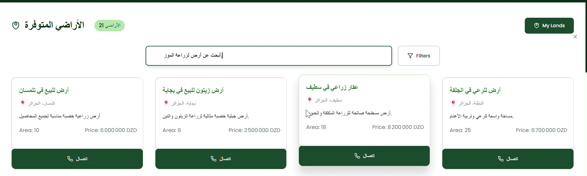
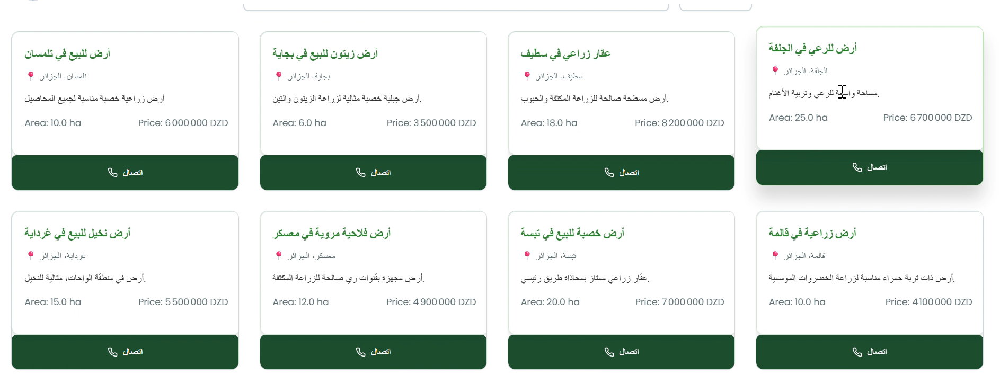

# 🌿 Smart Land – Application de Location Intelligente de Terrains Agricoles

**Smart Land** est une application mobile dédiée à la **location de terrains agricoles**. Grâce à l’intelligence artificielle, elle permet aux agriculteurs, investisseurs et exploitants de **trouver rapidement un terrain adapté** à leurs besoins, en fonction du **climat local**, des **produits agricoles visés**, et des **caractéristiques du sol**.

---

## Fonctionnalités principales :

### 🔍 Filtrage intelligent des terrains
- Recherche de terrains selon la **localisation**, la **superficie**, et la **durée de location**.
- **Filtrage climatique** : Affiche uniquement les terrains compatibles avec les cultures envisagées selon le **climat local (température, pluviométrie, humidité)**.
- **Analyse de rentabilité** : Estimation de la productivité selon la culture choisie et la région.

### 🧠 Recommandations basées sur un modèle NLP (traitement du langage naturel)
- L’utilisateur peut décrire le type de terrain souhaité (ex : "terrain pour culture de tomate sous serre dans région humide") et le système propose automatiquement des terrains adaptés.
- **Compréhension automatique** des besoins via NLP et suggestions instantanées.

### 🌍 Carte interactive
- Visualisation de tous les terrains sur une carte avec **indicateurs climatiques**.
- Accès aux détails du terrain (sol, accès à l’eau, climat, prix, disponibilité).

---

## Aperçu de l'application

### 1. Recherche et filtrage intelligent des terrains

### 2. Contacte 

### 3. afficher les terrains

---

## Objectif :
Faciliter l’accès aux terrains agricoles adaptés pour la **production agricole optimisée**, tout en **réduisant le risque climatique** et en **maximisant la rentabilité** grâce à l’intelligence artificielle et au traitement automatique du langage.

---

